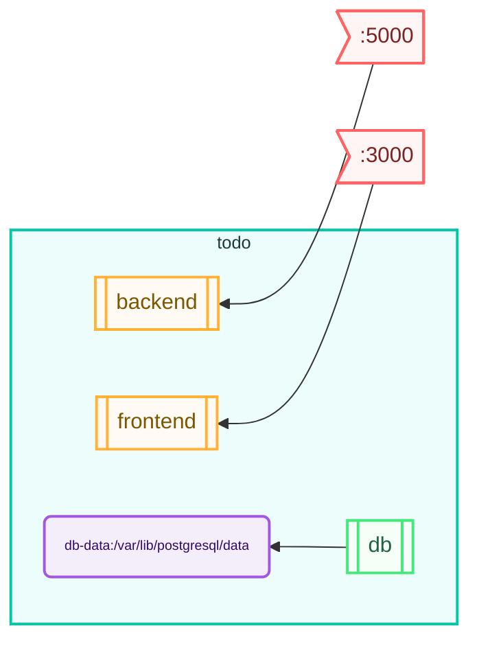

# Todo List Application

This project shows how to use the [stack](https://github.com/bozemanpass/stack) tool to build and deploy a simple Todo List application built with React for the frontend and Node.js for the backend, using PostgreSQL as the database.  It was AI generated using GitHub Copilot.

## Project Structure

```
todo-list-app
├── backend          # Backend application
│   ├── src         # Source files for the backend
│   ├── package.json # Backend dependencies and scripts
│   ├── tsconfig.json # TypeScript configuration for the backend
│   └── README.md    # Documentation for the backend
├── frontend         # Frontend application
│   ├── src         # Source files for the frontend
│   ├── package.json # Frontend dependencies and scripts
│   ├── tsconfig.json # TypeScript configuration for the frontend
│   └── README.md    # Documentation for the frontend
├── composefile.yml # Stack/Docker configuration for the application
└── README.md        # Main documentation for the project
```

## System Diagram
This diagram was auto-generated with the `stack diagram` command:


## Getting Started

### Prerequisites

- Node.js
- PostgreSQL
- Docker (optional, for running with Docker)

### Backend Setup

1. Navigate to the `backend` directory:
   ```
   cd backend
   ```

2. Install dependencies:
   ```
   npm install
   ```

3. Set up the PostgreSQL database and update the connection settings in `backend/src/database/index.ts`.

4. Start the backend server:
   ```
   npm start
   ```

### Frontend Setup

1. Navigate to the `frontend` directory:
   ```
   cd frontend
   ```

2. Install dependencies:
   ```
   npm install
   ```

3. Start the frontend application:
   ```
   npm start
   ```

### Running with Stack
To download, build, configure, and deploy the application using [stack](https://github.com/bozemanpass/stack/), run:

```
# clone
stack fetch repo bozemanpass/example-todo-list

# build
stack prepare --stack todo

# configure
stack init --stack todo --output todo.yml --map-ports-to-host localhost-same

# deploy
stack deploy --spec-file todo.yml --deployment-dir ~/deployments/todo

# run
stack manage --dir ~/deployments/todo start
```

### Running with Docker

To run the application using Docker, you can use the provided `composefile.yml` file. Simply run:

```
docker compose -f composefile.yml up --build
```

This will start both the backend and PostgreSQL database in separate containers.

## API Endpoints

The backend provides the following API endpoints for managing todos:

- `GET /todos` - Retrieve all todos
- `POST /todos` - Create a new todo
- `PUT /todos/:id` - Update an existing todo
- `DELETE /todos/:id` - Delete a todo

## License

This project is licensed under the MIT License.
