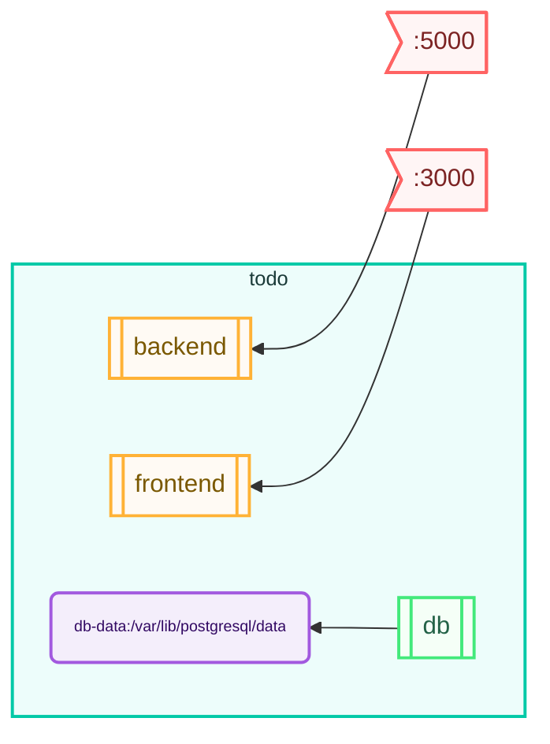

# Todo List Application


This project shows how to use the [stack](https://github.com/bozemanpass/stack) tool to build and deploy a simple Todo List application built with React for the frontend and Node.js for the backend, using PostgreSQL as the database.  It was AI generated originally using GitHub Copilot then subsequently 
updated and enhanced by Claude Code.

## Project Structure

```
todo-list-app
├── backend               # Backend application (Node.js/Express)
│   ├── src               # Source files for the backend
│   ├── package.json      # Backend dependencies and scripts
│   ├── tsconfig.json     # TypeScript configuration for the backend
│   └── README.md         # Documentation for the backend
├── frontend              # Frontend application (React/Vite)
│   ├── src               # Source files for the frontend
│   ├── public            # Static assets (icons, manifest, robots.txt)
│   ├── .env.production   # Build-time env; holds the runtime-substituted API URL
│   ├── package.json      # Frontend dependencies and scripts
│   ├── tsconfig.json     # TypeScript configuration for the frontend
│   ├── vite.config.ts    # Vite build configuration
│   └── README.md         # Documentation for the frontend
├── stacks
│   └── todo              # The stack definition for the whole application
│       ├── stack.yml     # Containers, wrappers and pods making up the stack
│       └── stack.lock    # Pinned wrapper versions, written by `stack prepare`
├── composefile.yml       # The stack's pod: frontend, backend and PostgreSQL
├── tests
│   ├── e2e               # End-to-end test: deploys the stack, drives a browser
│   └── lib               # Shell helpers shared by the test and the demo
├── demo                  # Scripts that record the animation at the top of this page
├── docs/images           # Images used by the documentation
├── .github/workflows     # CI: runs the end-to-end test on every push
└── README.md             # Main documentation for the project
```

Neither application has a Dockerfile: the stack builds each one with a
[wrapper](https://github.com/bozemanpass/stack-wrapper-webapp) named in
`stacks/todo/stack.yml` — `webapp` for the static frontend, `node-service` for the
long-running backend.

## System Diagram
This diagram was auto-generated with the `stack chart` command:

```mermaid
flowchart RL
  todo-backend-http>:5000]:::http_target
  todo-frontend-http>:3000]:::http_target
  todo-backend-http --> todo-backend
  todo-frontend-http --> todo-frontend
  subgraph todo [todo]
    todo-backend[[backend]]:::http_service
    todo-frontend[[frontend]]:::http_service
    todo-db[[db]]:::service
    todo-db-volume-db-data:/var/lib/postgresql/data(db-data:/var/lib/postgresql/data):::volume
    todo-db --> todo-db-volume-db-data:/var/lib/postgresql/data
  end
  classDef super_stack stroke:#FFF176,fill:#FFFEEF,color:#6B5E13,stroke-width:2px,font-size:small;
  classDef stack stroke:#00C9A7,fill:#EDFDFB,color:#1A3A38,stroke-width:2px,font-size:small;
  classDef service stroke:#43E97B,fill:#F5FFF7,color:#236247,stroke-width:2px;
  classDef http_service stroke:#FFB236,fill:#FFFAF4,color:#7A5800,stroke-width:2px;
  classDef http_target stroke:#FF6363,fill:#FFF5F5,color:#7C2323,stroke-width:2px;
  classDef port stroke:#26C6DA,fill:#E6FAFB,color:#074953,stroke-width:2px,font-size:x-small;
  classDef volume stroke:#A259DF,fill:#F4EEFB,color:#320963,stroke-width:2px,font-size:x-small;
  class todo stack;
```

## Getting Started

### Prerequisites

To deploy the application as a stack (the usual path, see
[Running with Stack](#running-with-stack)) all you need is Docker and
[stack](https://github.com/bozemanpass/stack/) itself.

To run the backend and frontend directly on your machine instead, you also need:

- Node.js (version 20.19 or higher)
- PostgreSQL

### Backend Setup

1. Navigate to the `backend` directory:
   ```
   cd backend
   ```

2. Install dependencies:
   ```
   npm install
   ```

3. Set up the PostgreSQL database and update the connection settings in `backend/src/database/index.ts`.

4. Start the backend server:
   ```
   npm start
   ```

### Frontend Setup

1. Navigate to the `frontend` directory:
   ```
   cd frontend
   ```

2. Install dependencies:
   ```
   npm install
   ```

3. Start the frontend application:
   ```
   npm start
   ```

### Running with Stack
To download, build, configure, and deploy the application using [stack](https://github.com/bozemanpass/stack/), run:

```
# clone
stack fetch repo bozemanpass/example-todo-list

# build
stack prepare --stack todo

# configure
stack init --stack todo --output todo.yml --map-ports-to-host localhost-same

# deploy
stack deploy --spec-file todo.yml --deployment-dir ~/deployments/todo

# run
stack manage --dir ~/deployments/todo start
```

## Testing

`tests/e2e/run-e2e-test.sh` is an end-to-end test: it deploys this repo's working
copy as a stack, to a local docker compose deployment, and then drives the
deployed application through a headless browser -- adding todos, completing one,
reloading the page to check they were really stored, and deleting them again.

```
./tests/e2e/run-e2e-test.sh
```

It needs `docker`, `curl`, `jq`, and a `stack` on the PATH (see
[releases](https://github.com/bozemanpass/stack/releases); set `STACK` to test a
different one).  The browser runs in the official Playwright container image, so
nothing else has to be installed.  Ports 3000, 5000 and 5432 must be free.

The browser takes screenshots as it goes -- and one more at the point of failure,
if it fails -- into `tests/e2e/results/`.  It also fetches every icon the page
declares (the favicons and the apple-touch-icon), fails if one is missing, and
saves them there too: a screenshot captures the page, not the browser's tab
strip, so it cannot show a favicon.  The same test runs in CI
(`.github/workflows/test-e2e.yml`), where that directory is uploaded as the
`browser-screenshots` build artifact, so how the application actually looked can
be checked from the run's summary page.

## The animation

The GIF at the top of this page is recorded by `./demo/record-demo.sh`, which
deploys the application as a stack and drives the deployed app through a browser.
Nothing in it is faked: every todo in it is really created, completed and deleted
in PostgreSQL by the running application.  See [demo/README.md](demo/README.md)
for how to re-record it.

## API Endpoints

The backend provides the following API endpoints for managing todos:

- `GET /todos` - Retrieve all todos
- `POST /todos` - Create a new todo
- `PUT /todos/:id` - Update an existing todo
- `DELETE /todos/:id` - Delete a todo

## License

This project is licensed under the MIT License.
